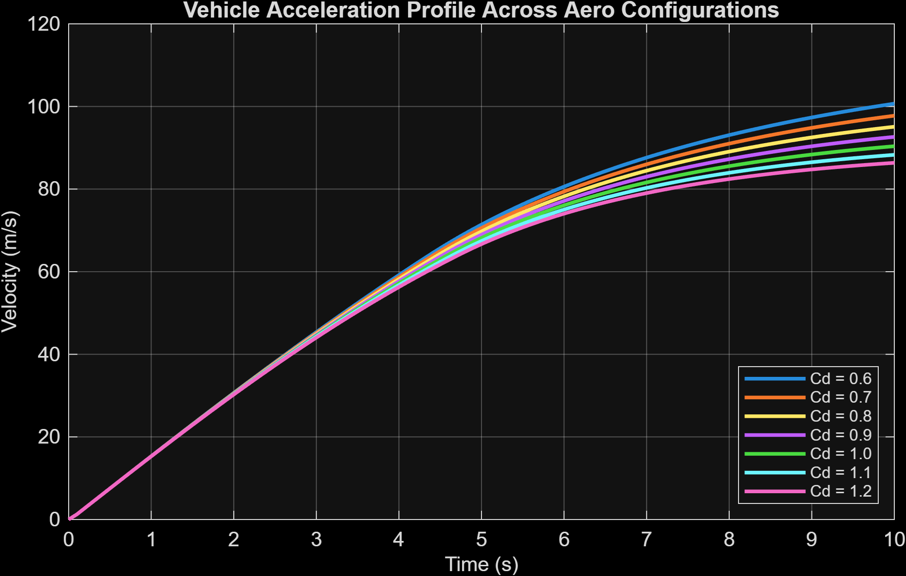
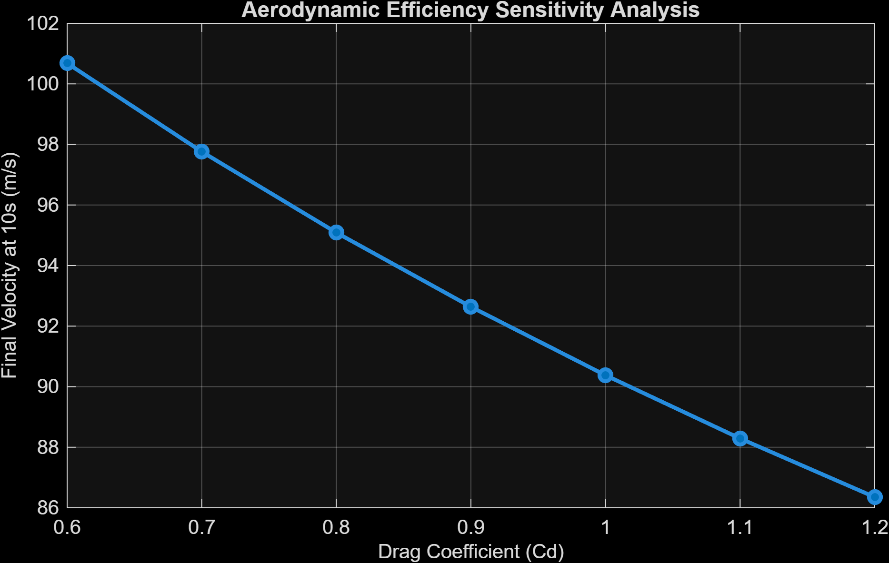

# Longitudinal Vehicle Performance & Aero Sensitivity Engine

A MATLAB simulation framework modeling longitudinal vehicle acceleration under real-world physical constraints—specifically tire friction limits, dynamic power curves, and aerodynamic drag—alongside a drag coefficient ($C_d$) sensitivity sweep.

---

## 🚀 Repository Architecture
### 1. Velocity Profile Across Aero Configurations


### 2. Aerodynamic Efficiency Sensitivity Analysis

```text
vehicle-dynamics-sims/
│
├── src/
│   └── vehicle_performance_sim.m   # Core simulation & sensitivity analysis script
├── outputs/

