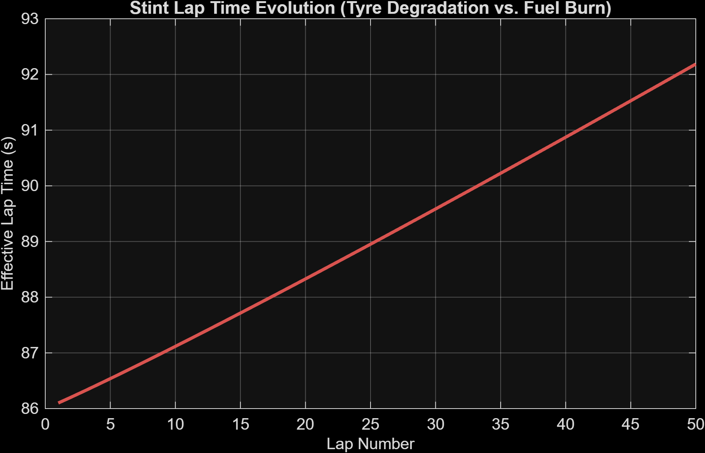

# Vehicle Dynamics & F1 Race Strategy Simulation Suite

An advanced MATLAB simulation framework designed to model longitudinal vehicle acceleration under physical grip/power constraints, execute aerodynamic drag sensitivity sweeps, and optimize Grand Prix race strategy and tactical pit windows.

---

## 🚀 Visual Outputs & System Dashboards

### 1. Longitudinal Vehicle Acceleration & Aero Sensitivity (`vehicle_performance_sim.m`)
Evaluates straight-line acceleration under tire grip limits ($\mu = 1.6$), power curves ($F = P / v$), and aerodynamic drag coefficient ($C_d$) sweeps from $0.6$ to $1.2$.


### 2. Tactical F1 Stint & Crossover Strategy (`F1_Strategy_Sim.m`)
Models live-race decision making, safety car phases, fuel-mass penalties, and non-linear tire degradation cliffs.


---

## 📐 Mathematical Foundations & Governing Equations

### Net Force & Forward Euler Integration
At any given point, the net force ($F_{net}$) balances tire/engine limits against aerodynamic drag:
$$F_{net} = \min\left(\frac{P_{max}}{v}, \mu \cdot m \cdot g\right) - \left(0.5 \cdot \rho \cdot v^2 \cdot C_d \cdot A\right)$$

Velocity updates iteratively using a standard forward Euler step:
$$v_{i+1} = v_i + \left(\frac{F_{net}}{m}\right) \cdot \Delta t$$

---

## 📂 Repository Architecture

```text
vehicle-dynamics-sims/
├── src/
│   ├── vehicle_performance_sim.m     # Longitudinal vehicle acceleration & Cd sensitivity
│   ├── F1_Strategy_Sim.m             # Tactical live-race decision engine (SC/VSC & wear)
│   └── Stint_Fuel_Tyre_Optimizer.m   # Fuel-mass vs. non-linear tire cliff evolution model
├── outputs/
└── README.md

